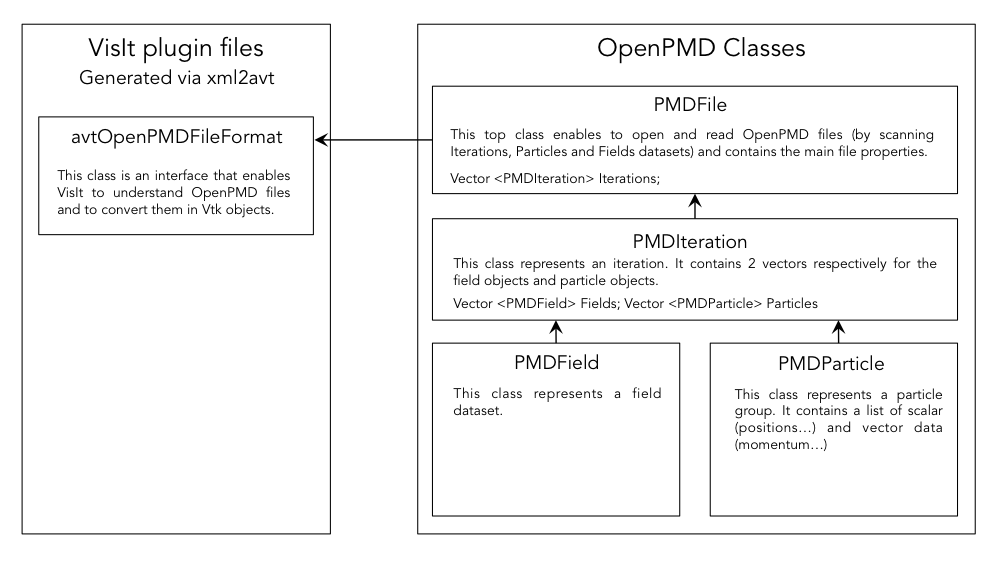

OpenPMD plugin for VisIt
========================

#### Table of Contents
1. [Presentation](#Presentation)
2. [Repository and code structure](#Repository-and-code-structure)
3. [Installation](#Installation)
4. [To be implented/improved](#To-be-implemented/improved)

## Presentation
-------------------

This repository contains the sources for development of an OpenPMD plugin for the visualization software [VisIt](https://wci.llnl.gov/simulation/computer-codes/visit).

## Repository and code structure
------------------------------------

#### Files

This repository contains:

- the C++ source files
- an xml file `OpenPMD.xml` essential for building the plugin
- a Doxygen documentation (in the directory `/Doxygen`) that describes the different classes
- this `README.md` file

Sources are composed of files generated by Visit:

- `avtOpenPMDFileFormat.C`: class for reading and converting file format in vtk
- `OpenPMDEnginePluginInfo.C`
- `OpenPMDMDServerPluginInfo.C`
- `OpenPMDCommonPluginInfo.C`
- `OpenPMDPluginInfo.C`

And external C++ classes developped for reading OpenPMD files:

- `PMDFile.cpp`: Open, scan and print OpenPMD file structures
- `PMDiteration.cpp`: class for the iteration groups
- `PMDField.cpp`: class for the field groups
- `PMDParticle.cpp`: class for the particle groups

#### How works this plugin

Visit plugins basically read outputs with some specific code or data formats to convert them internally into vtk readable data.



#### How to generate the Doxygen documentation

First, download and install [Doxygen](http://www.stack.nl/~dimitri/doxygen/download.html).

You can create the documentation by command line ([see this page for more information](https://www.stack.nl/~dimitri/doxygen/manual/doxygen_usage.html))

```
doxygen Doxygen/Doxyfile
```

You can also use the GUI frontend. Open `Doxygen/Doxyfile`, go to `Run`, click on `Run Doxygen` and finally `Show HTML output`.

## Installation
---------------------

For more information about how to generate install a plugin, please, consider the following links:

- [Getting Data Into Visit (official pdf)](https://wci.llnl.gov/content/assets/docs/simulation/computer-codes/visit/GettingDataIntoVisIt2.0.0.pdf)
- [NERSC Visit presentation and instructions](http://www.nersc.gov/users/data-analytics/data-visualization/visit-2/)

Visit contains a series of tools that makes it easy to create and generate plugins. Without going to the details, we will use one of them (`xml2cmake`) to install this plugin. These tools are located in the directory `<Visit application directory>/Contents/Resources/bin/`.

You also need to install [cmake](https://cmake.org/download/).

#### MacOs

First, download and install [VisIt](https://wci.llnl.gov/simulation/computer-codes/visit/downloads). You can install it from the sources but if you only want to use it, we recommend to use the .dmg image for MacOs.

On MacOs, you can choose to install the plugin only for you or all users.
For this aim, we will first use the xml2cmake tool located in `<Visit application directory>/Contents/Resources/bin/`.
We recommend to add an alias in your `~/.profile`. 

To install the plugin for you:

```
xml2cmake OpenPMD.xml
```

In this case, the compiled library will be generated in the directory `~/.visit/`.

To install the plugin for all users:

```
xml2cmake -public -clobber OpenPMD.xml
```

In this case, the plugin will be located where you have installed VisIt. If you used the .dmg image, you will find the files in:

```
/Applications/VisIt.app/Contents/Resources/<VisIt version>/darwin-x86_64/plugins/databases/
```

This step generates the file `CMakeLists.txt` in the source directory.

Then, prepare the makefile by doing

```
cmake -DCMAKE_BUILD_TYPE:STRING=Debug
```

This step generates the files `CMakeFiles`, `CMakeCache.txt` and `cmake_install.cmake`.

To compile and generates the library:

```
make
```

You have almost finished, make sure that the libraries are well generated in their corresponding directories. You should be able to find the files `libEOpenPMDDatabase_ser.dylib`, `libMOpenPMDDatabase.dylib`, `libEOpenPMDDatabase_par.dylib`.

#### NERSC

To use Visit on NERSC machines, it is recommended to run Visit on your local computer in client-server mode. Intructions can be found [by clicking on this link](http://www.nersc.gov/users/data-analytics/data-visualization/visit-2/).

First, setup your environment:

```
module swap PrgEnv-intel PrgEnv-gnu-VisIt
module unload darshan
module unload craype 
```

Then, load the visit module:

```
module load visit/<your favorite version>
```

Then load the last version of cmake:

```
module load cmake/<the last version number>
```

Then, enter to generate the file `CMakeLists.txt`:

```
xml2cmake OpenPMD.xml
```

If you have the permission, you can create a common installation by doing:

```
xml2cmake -public -clobber OpenPMD.xml
```

Then, prepare the makefile by doing

```
cmake -DCMAKE_BUILD_TYPE:STRING=Debug
```

This step generates the files `CMakeFiles`, `CMakeCache.txt` and `cmake_install.cmake`.

To compile and generates the library:

```
make
```

The libraries (`libEOpenPMDDatabase_par.so`, `libEOpenPMDDatabase_ser.so`, `libIOpenPMDDatabase.so`, `libMOpenPMDDatabase.so`) are located in the following directory:

```
/global/homes/<first login letter>/<login>/.visit/<VisIt version>/linux-x86_64/plugins/databases/
```

## To be implemented/improved
-------------------------

- The plugin is not reading all the group and dataset attributes. More attribute readers need to be implemented although the necessary ones for visualization are present.
- The plugin does not take into account dataset of mass or charge (it only works when these are constant).
- Field axis labels, fieldBoudary conditions are not read properly.
- The documentation (Doxygen) has to be completed.
- Create compatibility for 2D grids, only 3D grids can be read properly.
- Implementing the reading of curvilinear meshes for cylindrical geometry.
- Implementing Fortran order, only C order is taken into account
- Improving Exception output.
- Read files in parallel using ADIOS.
- Parallel access and treatment of the files.